# 动漫人物分类识别
Python &amp; Deep Learning 101 Assignment #2

## 分工情况

- [付佳伟](https://github.com/ibug) (fjw)，PB17111643，主要负责最终网站的前后端设计。
- [李晨宇](https://github.com/breakingdevil) (lcy)，PB17061207，主要负责最终网站的前后端设计。
- [陶柯宇](https://github.com/taoky) (tky)，PB17111630，主要负责数据的收集、标注、处理 ~~，顺便整理一下大家的报告~~。
- [张永停](https://github.com/SqrtiZhang) (zyt)，PB17111585，主要负责深度学习算法的调研、解释、使用等。

## 任务说明

*written by tky*

### 来源

一开始定题的时候大家都很纠结，想了几天都没有很好的想法。之后有一天我看到有人在某个群里发了一张很好玩的 GIF 表情。

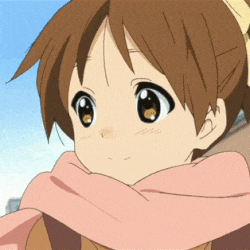

*就是这张，原图没有找到，自己花了点时间重新做了一份。*

然后呢，我就隐隐约约有一种「好像很熟悉但是忘了是在哪儿看到的了」这种感觉，~~都是京都脸害的，~~ 之后就想——要不就搞一个学习分类 ACG 人物的项目吧，告诉我们图片中出现的角色到底是谁。图像分类应该是比较成熟的了，对于我们这四条以前从来没玩过深度学习的咸鱼来说（看起来）还是比较合适的。

于是最后大家就一致同意（？）了，在考完数理方程之后就开搞了。

### 实际问题

正如上文提到的那样，有时候你看到了一张可爱或者搞笑的表情包、一张动画截图，或者一副 ACG 人物的插画，但很多时候你就是不知道在图片里面他们/她们是谁。

Google 搜图可以帮助解决一部分的问题，但是——

- 不是所有人都有畅通的网络。

- 有时候第一眼的结果会让你比较失望。

  

  *你说得很对，但是一点用都没有。*

同时，网络中也有一些专门用于搜索 ACG 图片等的服务，例如 [trace.moe](https://github.com/soruly/trace.moe)，使用了 [MPEG 7 Color Layout Descriptor](https://en.wikipedia.org/wiki/Color_layout_descriptor)，一种高效的分块、概括颜色的算法。其对动画的每帧都做了这样的索引。但也同时由于这个特性，在图像被裁减之后，由于全图颜色分布发生了比较大的变化，识别准确率会大幅下降。

所以，如果我们有足够的数据的话，最后用深度学习来做这个效果可能会比这几种方案都好得多。

### 难点

- 数据很可能会不够：收集**足够多**的、**高质量**的角色面部数据不是一件简单的事情。对于神经网络来说，可能几千张还嫌少。
- 「长得差不多」：有好几位同学都跟我说「感觉这些角色长得都差不多啊」，~~不知道我们训练出来的网络会不会也这么想。~~  最后能不能有效区分各个角色也是一个问题。

## 数据处理

既然这个题目是我提的，而且看起来我们四个人中就只有我~~这个死宅~~看动画比较多，所以数据的收集与处理就只能我来做了。结果就是：爆肝了近一周才勉强把数据弄好。

### 收集

#### 现成的数据集？

第一步当然是去找有没有现成的数据集了。结果在 Kaggle 上有一个， 其中一个压缩包连标签都打好了，看起来很 promising。

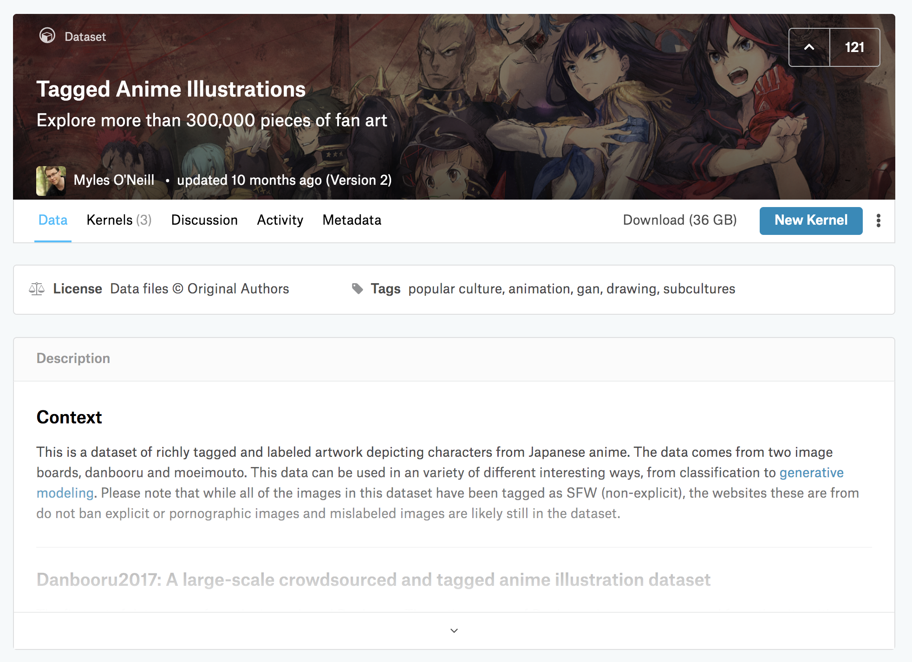

*[Tagged Anime Illustrations](https://www.kaggle.com/mylesoneill/tagged-anime-illustrations/home)*

我花（浪费）了两天时间整理了一下 `moeimouto-faces.zip` 中的内容，发现了一些残酷的现实：

- ~~有很多角色我都不认识。~~
- 图片的质量说实话，不是很好，有一些分类错误、难以辨认的，甚至还有一些比较恶心的图片……

最后我们没有使用这个数据集。如果你感到好奇的话，我发布了我整理过的版本（大小：311.37MB）：

```
分享地址：http://rec.ustc.edu.cn/share/052db520-7ba4-11e9-9c5f-2172227f4743
分享密码：948a
```

#### 视频、`ffmpeg` 与面部识别方案

之后，我就打算自己来搞数据了。首先想到的是从现有的动画的视频中截取一些帧出来再做处理。

- 如何下载需要的动画视频？对于大多数在线的流媒体服务来说，上面的视频可以用 [`you-get`](https://github.com/soimort/you-get), [`youtube-dl`](https://github.com/ytdl-org/youtube-dl), [`annie`](https://github.com/iawia002/annie) 等工具下载到。至于其它来源……方法总比困难多嘛，这里就不赘述了。

- 如何从视频中抽取帧？我的第一反应就是 `ffmpeg`（一个开源的多媒体处理程序），[果不其然](https://trac.ffmpeg.org/wiki/Create%20a%20thumbnail%20image%20every%20X%20seconds%20of%20the%20video)。以下的命令可以每 5 秒取一张图保存：

  ```
  ffmpeg -i 1.flv -vf fps=1/5 test%d.png
  ```

  为了 SSD 空间和后续处理方便考虑，需要把导出的图片弄小一点，加一个参数就能解决。

  ```
  ffmpeg -i 1.flv -s 960x540 -vf fps=1/5 test%d.png
  ```

  之后导出的图片大小都是 960x540 的了。

- 把一整张图打上标签就可以了吗？当然不行！

  - 一张图中可能会有多个角色。
  - 一整张图中有很多部分对我们识别人物没有价值，去掉它们可以加快训练的速度，减小对内存等资源的要求。
  - 所以要做面部识别！

##### OpenCV 方案：`lbpcascade_animeface.xml`

传统上来讲，OpenCV 使用预训练的 Haar Cascades 分类器检测物体（比如说人脸、人眼、猫咪，下面以人脸为例）。其预先拿一堆有人脸（positive）和没人脸（negative）的图片训练 cascade function。训练时使用了哈尔特征（Haar-like features），计算窗口中不同位置像素和的差，以差值做分类。此外，还使用了一些其他的算法，例如整合不同分类器的 Adaboost。[见此链接](https://docs.opencv.org/3.4/d2/d99/tutorial_js_face_detection.html)。

对于人脸来说，预置的分类器大部分时候没啥问题。

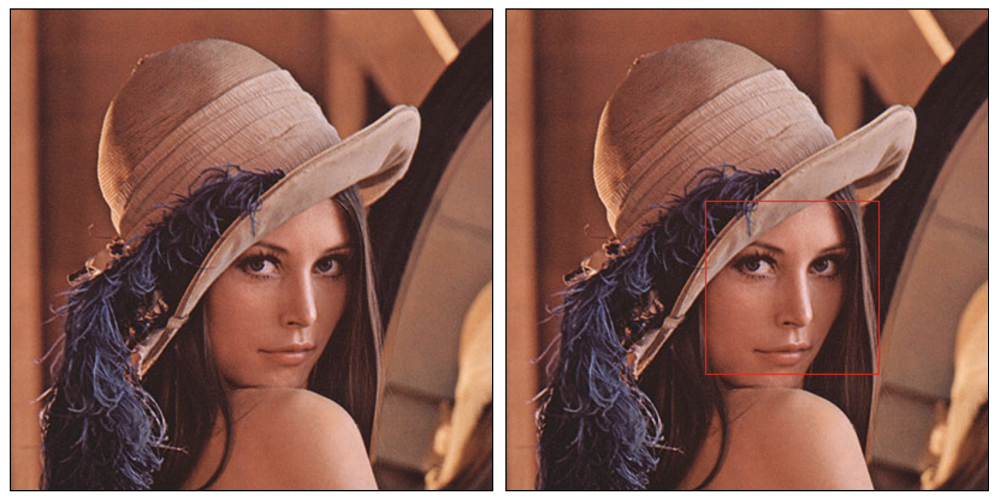

*Lenna 图官方样例。*

但根据以上的描述，我们可以猜到，这个分类器用在 ACG 人物上会发生什么。


*看起来不是很靠谱。*

所以怎么办？OpenCV 文档里有一篇[训练自己的 Haar Cascades 分类器的指南](https://docs.opencv.org/3.4/dc/d88/tutorial_traincascade.html)。但这不代表我们要自己来，因为已经有人干过这样的事情了。2011 年，[nagadomi](https://github.com/nagadomi)（他/她也是著名的动画风格图片超分辨率重建程序 [waifu2x](https://github.com/nagadomi/waifu2x) 的作者！）训练了一个动漫人物分类器：[lbpcascade_animeface](https://github.com/nagadomi/lbpcascade_animeface)。直接拿过来用就行。

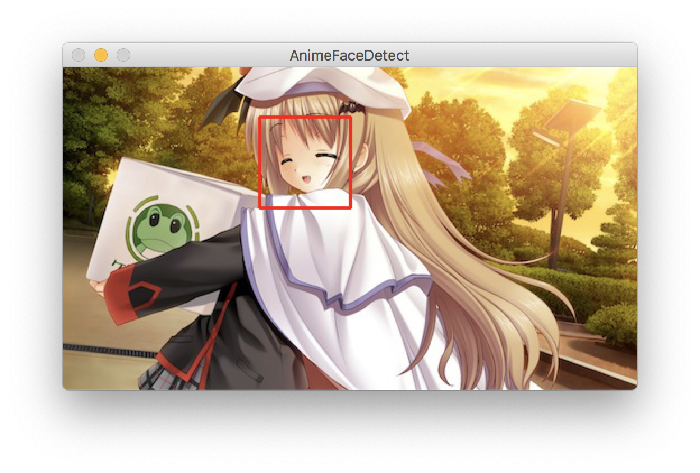

*识别出来了。*

##### `animeface-2009`

这是另一个动画面部识别的方案（和上面那个还是同一个作者），链接在[此](https://github.com/nagadomi/animeface-2009)。它与 `lbpcascade_animeface.xml` 相比准确性更高，但同时也需要更多的内存资源。如果内存不足，对于过大的图片可能会出现错误。

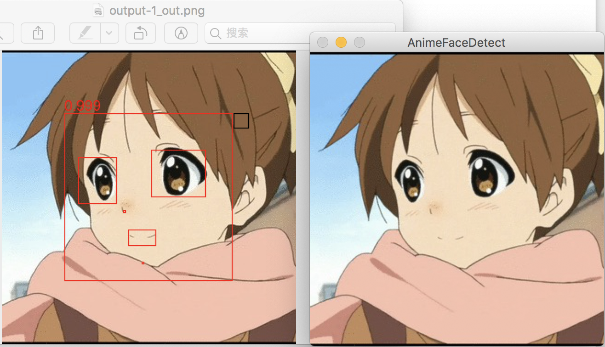

*左：`animeface-2009` 结果；右：`lbpcascade_animeface.xml` 结果。*

我构建了一个 Dockerfile 文件，方便此程序的部署。

最终的流程是：

- `ffmpeg` 在视频中抽取图像并缩放。
- `animeface-2009` 识别每张图中的脸部，生成「数据集」。
  - 我们使用的参数为：`--threshold 0.7 --margin 0.3`
- 那 `lbpcascade_animeface.xml` 呢？我们之后也会用到，后面会提到。

#### 无聊的日常

很遗憾，在这套流程走完之后，接下来就是机械性的打标签流程了。

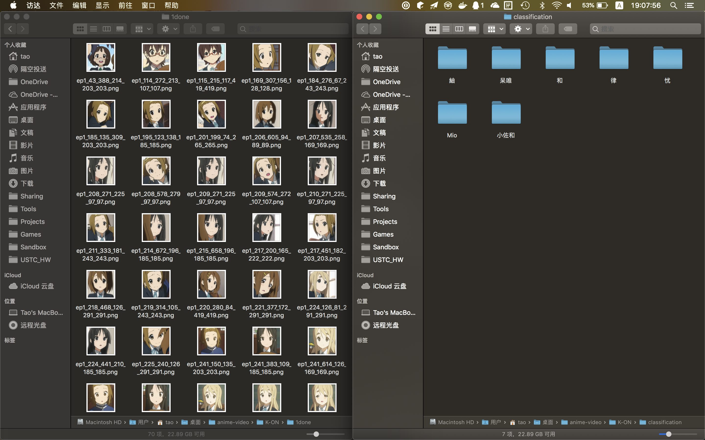

*把左边的图片中的 true positive 的部分正确地拖动到右边的文件夹里就行了。根据视频采样频率的不同，可能处理每一集的数据会有几十次到上百次的拖动。*

这花费了我绝大多数的时间。实话讲我不想这么搞，但是没有找到很好的办法。拜托别人来做也很困难，因为这一项分类需要后验知识（你在不了解某部作品的情况下，是不知道谁是谁的）。

#### 数据能不能再多一点？

我之前考虑过从一些插画网站上用爬虫爬取一些图片来做处理。最终我尝试使用 [PixivUtil2](https://github.com/Nandaka/PixivUtil2) 来根据标签爬取 Pixiv 上对应的图片，然后扔给 `animeface-2009` 来处理。

听起来是个不错的主意，但是：

- 我没有会员，搜索的时候没有办法按照热门度排序，只能按照时间来排。而这样的后果就是，在搜索列表里我看到了一些……像是小学生绘画风格的……作品。
- 就算在爬取的时候设置了收藏数的门槛，但是最后获得的结果依然画风各异，不太稳定。在 `animeface-2009` 处理完之后，有些我根本认不出来是谁。

最后向收集的数据集中加入了少量这类的图片。

#### 数据集总结

最终的数据集合计 31 个分类，来自 6 部动画作品 + 2 个小表情包，总计 7106 张图片。因为配角~~戏份~~数据不够，只给主角做了分类。

数据集（大小 517.19MB）：

```
分享地址：http://rec.ustc.edu.cn/share/7497ddc0-7ee8-11e9-a0f8-3ba73db94c06
分享密码：0984
```

## 算法原理

*written by zyt*

### 训练模型

- 算法以及具体实现

  - 由于此次实验~~是在数理方程考试后才开始做~~数据集个人团体收集较小，因此考虑迁移学习。
  - 本次实验采用 Inception-v3 模型，通过 Inception-v3 提取特征向量（瓶颈层），然后添加一层全连接层。通过训练确定全连接层的参数。
  - 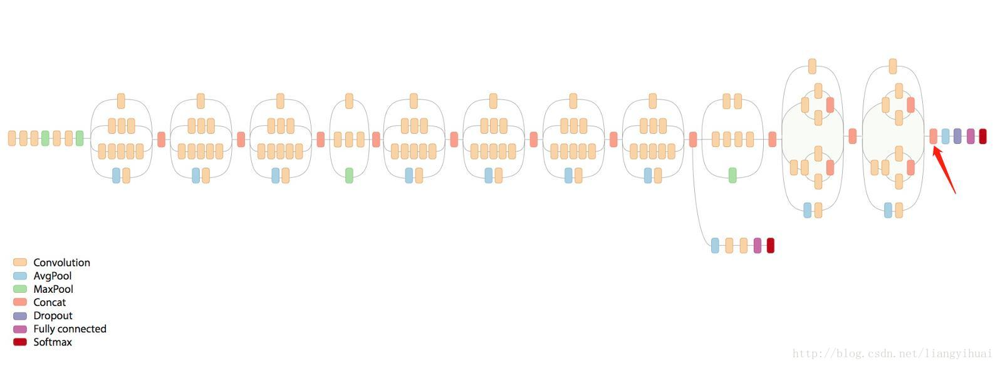

  	*Inception-v3 模型，红色箭头前面部分是卷积层，后面是全连接层*

  - Inception-v3 最后一个卷积层激活函数的输出值个数为 2048，我们图片共有 31 个分类。全连接层的输入就是 Inception-v3 最后一个卷积层激活函数的输出值（2048 维向量）。
  - 定义交叉熵作为损失函数，使用反向传播训练。训练时仅训练全连接层的参数。
  - 为了加快训练速度，我们将图片 的特征值缓存到硬盘中，这样在图片第二次被抽中训练时，可以直接从硬盘中读取特征值作为全连接层的输入数据。
  - 但如果使用该模块下的数据增广，则不会缓存特征值。
  - 训练集，测试集，验证集默认比例 8：1：1。
  - 通过 TensorBoard 可视化。

- 基本原理

  - Inception-v3 由谷歌提出，主要用于 ImageNet 的大规模视觉识别任务。本次实验目的是对动漫人物进行分类，与 Inception-v3 任务相似。因此可以借用该模型当作特征提取器，只训练最后的全连接层。

- 优势与不足

  - Inception-v3 反复使用了 Inception Block，涉及大量的卷积和池化。其错误率只有 3.5%。使用该模型当特征提取器准确率较高，且迁移学习不需要太大的数据集即可得到较准确的结果。
  - 直接使用 Inception-v3 来提取特征可能会导致训练效果有点差，不过总体来说这是我们在手头数据集不够大的情况下最好的选择。

### 数据增广

- 最初数据集大小 7000 多，直接进行训练。

- 
  

  *没有数据增广之前的结果，训练集达到了 95% 的准确率，但验证集只达到了 87% 的准确率，我们猜测可能有点过拟合，因此考虑数据增广*

- 后来采用 `retrain.py` 中的数据增广操作（剪切，放缩，翻转，改变透明度），这样便不能提前缓存图片的特征向量，因为在每次抽中图片时对图片所做操作可能不一样，于是导致了速度极慢，~~我跑了一天+一晚上才跑出结果~~。但虽然跑了这么久，结果却并不是很理想，最终训练结果甚至没有没有数据增广时效果好 TAT。

- 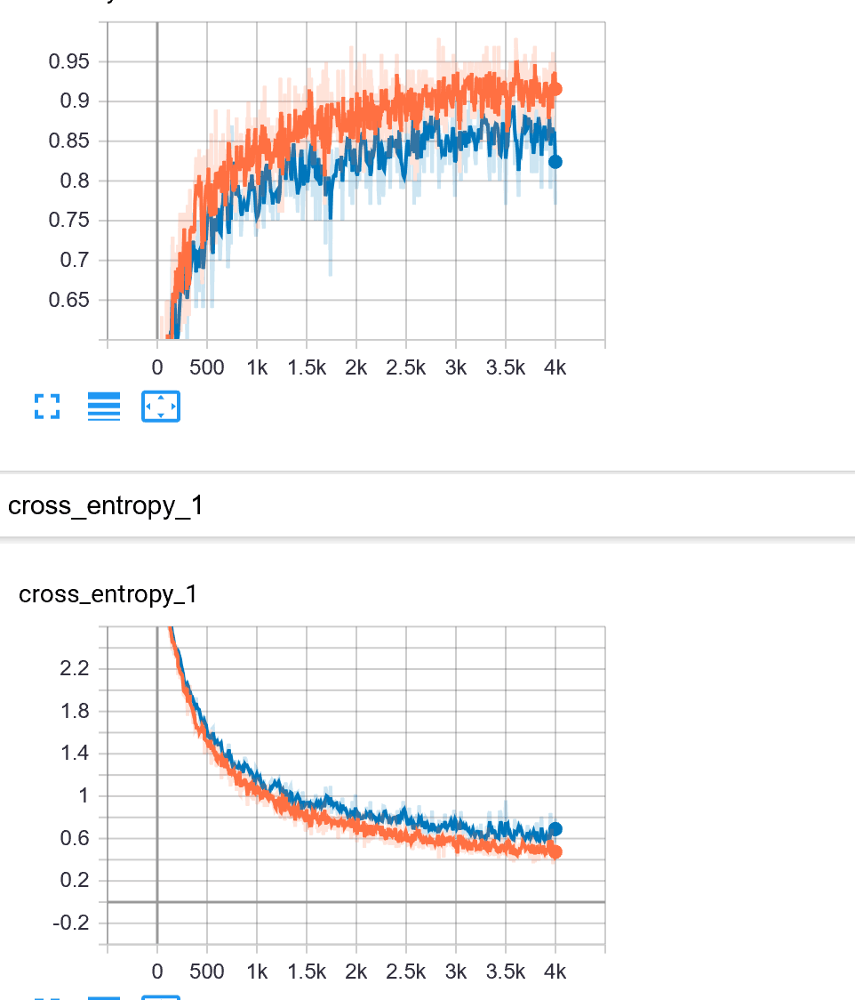
  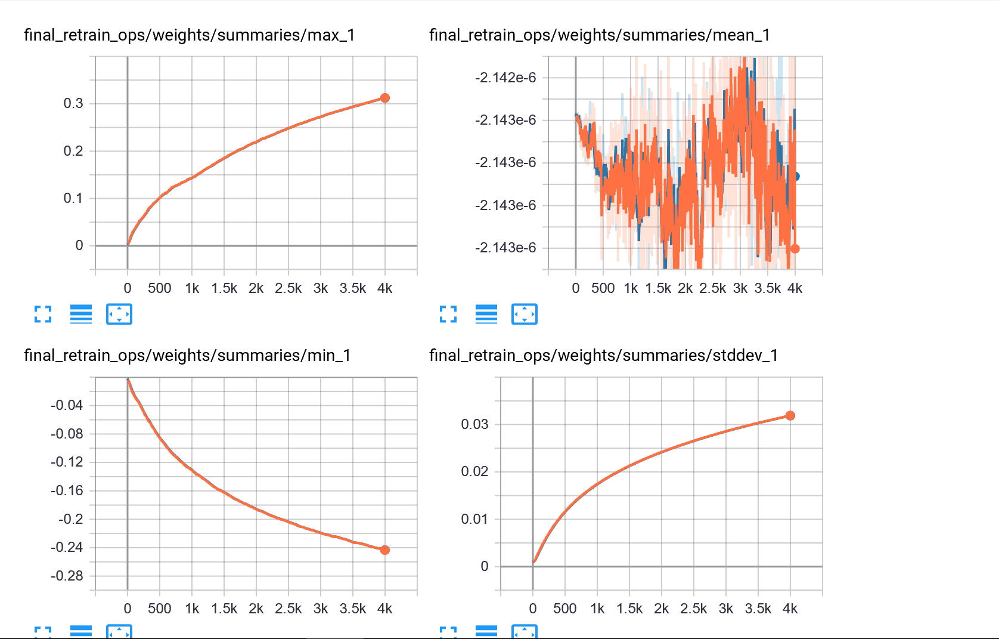

  *使用简单剪切翻转数据增广的结果*

- 后来经过~~沉重的反思~~，我们发现是因为上述数据增广其实对动漫人物识别作用并不是很大。于是乎，便开始认真上网查找数据增广的方法，最终，我决定使用 `imgaug` 库来做数据增广（~~此处吐血三升，要是早点查就好了~~）。

- 由于许多动漫人物的重要区别点是头发和眼睛的颜色，因此我在进行数据增广时并没有选择改变像素的操作。本次数据增广主要有:镜像翻转，剪切，放缩，旋转，仿射变换（矩形变为平行四边形），全白或全黑填充，高斯模糊，均值模糊，中值模糊，锐化处理，浮雕效果，改变对比度，移动像素，扭曲图像局部区域。这些操作会随机的被应用到图片上。考虑到数据集的大小，我选择将一张图片增广 64 张。

- 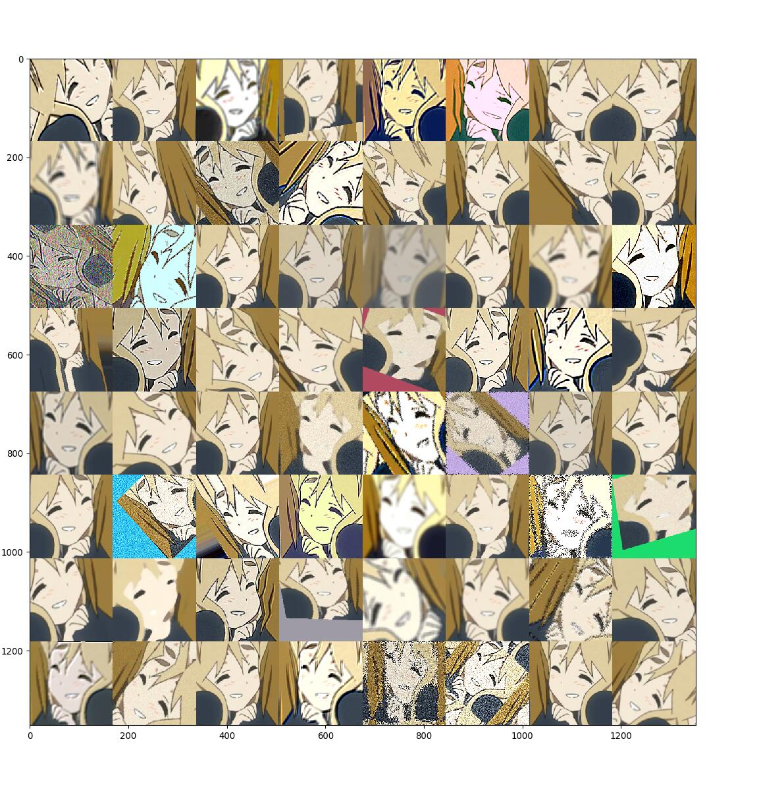
  

  *数据增广的效果*

- *数据增广后的图片共 7106\*65 张*

- 但最后这样数据增广后的效果很差，虽然没有明显的过拟合现象了，但在训练 10000 步后依然准确率只有 80% 多，我们认为可能是这样数据增广其实并不太适合动漫人物，因为动漫人物的脸形非常重要，所以扭曲可能就造成不好的结果。

- 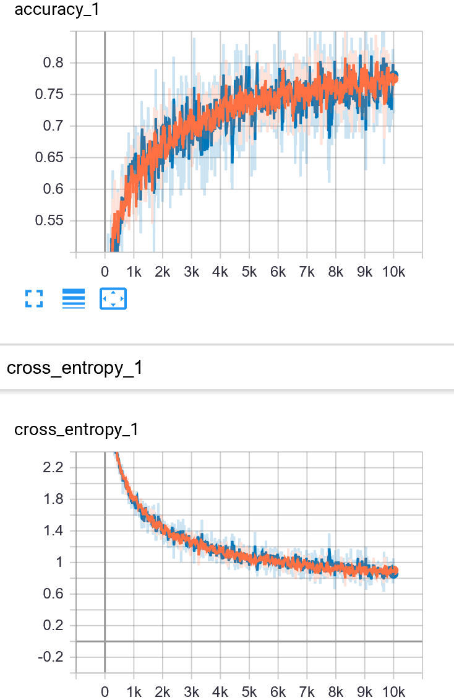

  *训练 10000 步的结果*

-  

  *训练 4000 步的结果*

- 数据增广的效果很差，~~但终于不过拟合了~~，我们此时认为之前训练略过拟合可能是数据集不够大。

### 输入图像分类

- 此部分就没什么技术含量（雾）。

- 将输入图片传入训练好的模型，根据模型的输出值（31 维向量）来判断该图片是哪一个动漫人物，并输出概率前五。

  - 训练好的 `output_graph.pb` 文件下载：

    ```
    分享地址：http://rec.ustc.edu.cn/share/a8386b80-88ff-11e9-a9eb-7776bafc0f5b
    分享密码：4430
    ```

-  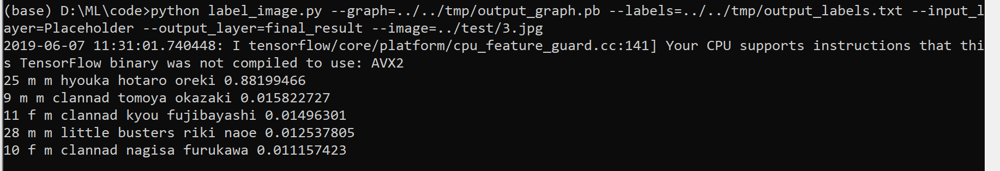

  *对一张测试图片进行判断*

## 实验细节

### 关于深度学习

- 使用交叉熵作为 loss 函数，我们没有修改 loss 函数，因为这是我们所知道的对图片分类最好的函数。
- 在数据增广的时候我们将 step 从 4000 增加到了 10000，虽然最后结果还是不理想。之前训练时并没有增加 step，因为从 tensorboard 的可视化结果来看，交叉熵和准确率都已经近乎不变了。
- 本次实验在最初将图片传给 Inception-v3 得到的计算结果缓存到电脑，这样在之后训练过程中不需要重复计算。
- 本次实验采用随机梯度下降法。
- 我们将数据集扩大，将种类减少，使得训练结果更好(详见数据处理 Taoky 部分)；后期将数据增广，但并没有得到很好的效果。
- 最终我们采用 7000 余张图片训练出来的结果。

### 关于「网站」的前后端设计

*written by lcy*

我们最终呈现给用户的是一个网站。这个网站允许用户选择图片中出现的动漫人物脸部图片并上传，服务器计算后返回结果。与此同时，用户可以向我们反馈识别错误的结果，以允许我们进一步优化。

#### 前端

为了方便用户选择脸部特征，我们决定把识别任务放在前端来做。这里就使用到了 OpenCV。通过近年来大热的 WebAssembly 技术——在现代浏览器中执行类似汇编的二进制代码，达到接近原生的性能——，OpenCV 也可以在浏览器端执行。这就是 OpenCV.js。

##### OpenCV.js

为了得到 OpenCV.js 文件，我们需要安装 Emscripten，它可以将 C/C++ 代码编译为 JavaScript 代码。

获取 OpenCV 源码后，就可以编译了。
```
git clone https://github.com/opencv/opencv.git
<opencv_src_dir>/platforms/js/build_js.py <build_dir>
```
需要注意的是这个脚本依赖 cmake。


*生成的 js 文件。*

编译完成后，我们可以使用官方样例测试一下。

```html
<!DOCTYPE html>
<html>
<head>
<meta charset="utf-8">
<title>Hello OpenCV.js</title>
</head>
<body>
<h2>Hello OpenCV.js</h2>
<p id="status">OpenCV.js is loading...</p>
<div>
  <div class="inputoutput">
    
    <div class="caption">imageSrc <input type="file" id="fileInput" name="file" /></div>
  </div>
  <div class="inputoutput">
    <canvas id="canvasOutput" ></canvas>
    <div class="caption">canvasOutput</div>
  </div>
</div>
<script type="text/javascript">
let imgElement = document.getElementById('imageSrc');
let inputElement = document.getElementById('fileInput');
inputElement.addEventListener('change', (e) => {
  imgElement.src = URL.createObjectURL(e.target.files[0]);
}, false);
imgElement.onload = function() {
  let mat = cv.imread(imgElement);
  cv.imshow('canvasOutput', mat);
  mat.delete();
};
function onOpenCvReady() {
  document.getElementById('status').innerHTML = 'OpenCV.js is ready.';
}
</script>
<script async src="opencv.js" onload="onOpenCvReady();" type="text/javascript"></script>
</body>
</html>
```

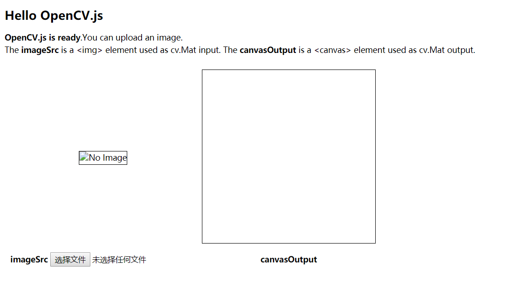

*OpenCV.js is ready.*

结果显示 `OpenCV.js is ready.`，没有问题。

##### 其它逻辑部分

*written by fjw*

这里的主要工作是写 HTML, CSS 和 Javascript。最起始的代码是 lcy 写的，使用了 OpenCV.js 和[一个交互式剪裁图片的前端库](https://github.com/zimv/zmCanvasCrop)。但是由于 lcy 误解了 tky 的需求，并且代码质量也不是很高，就由我来对前端代码进行修改，并且添加需要的功能。

主要的修改有：

- 由于 lcy 以前没有写过 JS，代码出现了一些非常怪异的做法，比如说在某个标签中加入代码，然后 JS 部分获取标签中的内容再 `eval()`。我修改了一部分代码，将一些功能包装成了函数，以使结构看起来更加清晰。
- 删除了一些根本没有用到的函数。
- 原先 lcy 选择的前端库中一剪裁结束就会调用上传函数，不太符合我们的需求。对这个前端库的代码做了一些修改。
- 使 OpenCV.js 脸部识别和用户手动剪裁的结果能够共同塞入一个 `<div>` 中，形成列表。加入了删除某项的功能、反馈错误结果的功能，最终上传时会一起上传到服务器上。

同时，我也把后端接收图片的功能单独包装成了函数。

使用 Bootstrap 对网页进行美化的工作由 tky 完成。

#### 后端

后端使用 Flask 框架，配合 TensorFlow，使用已经训练好的模型提供分类结果。Python 代码主要分成两个文件：`app.py` 和 `classification.py`。

##### `app.py`

这个文件为整个 Flask web app 的核心文件，设置了三个路由：

- `@app.route("/")`: 返回 `index.html` 的内容。
- `@app.route("/uploadForIdent", methods=['POST'])`: 接收用户上传识别的图片，并调用 `classification` 中的 `web_api` 函数。
- `@app.route("/report", methods=['POST'])`: 接收用户的错误反馈，并保存。

其中 `receive_img()` 是从前端接收图片（的 base64）并保存的辅助函数。

##### `classification.py`

此文件作为神经网络的 API 接口，我们通过此文件实现后端和神经网络的交互。

其它需要的 CSS, JS 与数据文件在 `static/` 目录下，主页的 HTML 在 `templates/` 目录下。

## 展示效果

在 `web_app` 目录下使用 `pip install -r requirements.txt` 安装了必要的库之后（建议在虚拟环境中进行），复制 `output_graph.pb` 到 `static/data/` 目录下，然后运行 `app.py` 以启动网页服务。

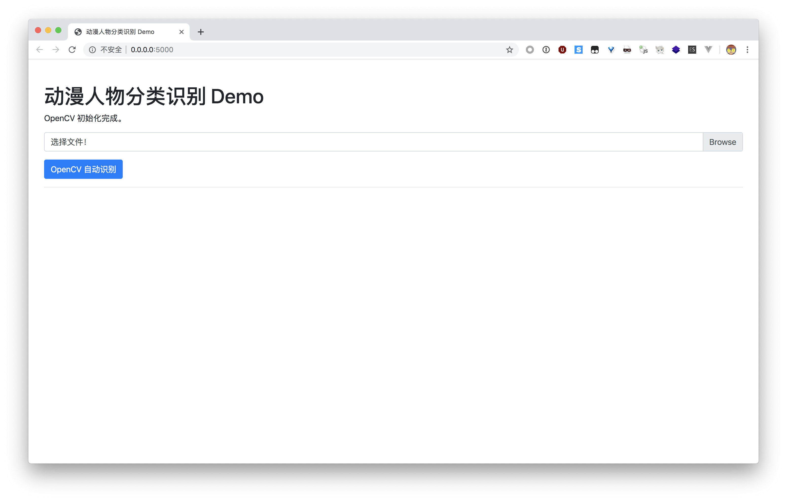

*初始界面*

打开一张图片后，可以使用「OpenCV 自动识别」，也可以手动框选添加面部图片。

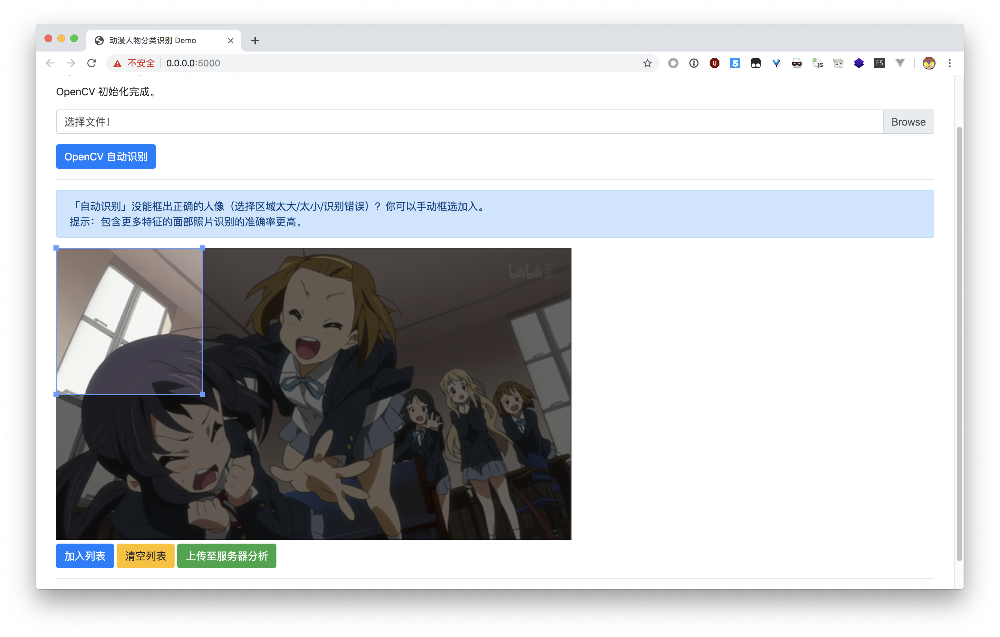

*选择面部图片*

完成后，点击「上传至服务器分析」，等待片刻后会返回结果。

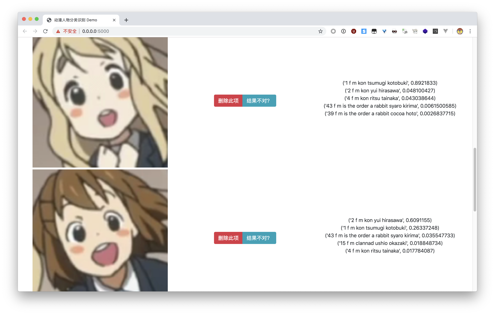

*分析结果*

如果发现有图片识别错误，可以点击「结果不对？」按钮，反馈正确的结果。

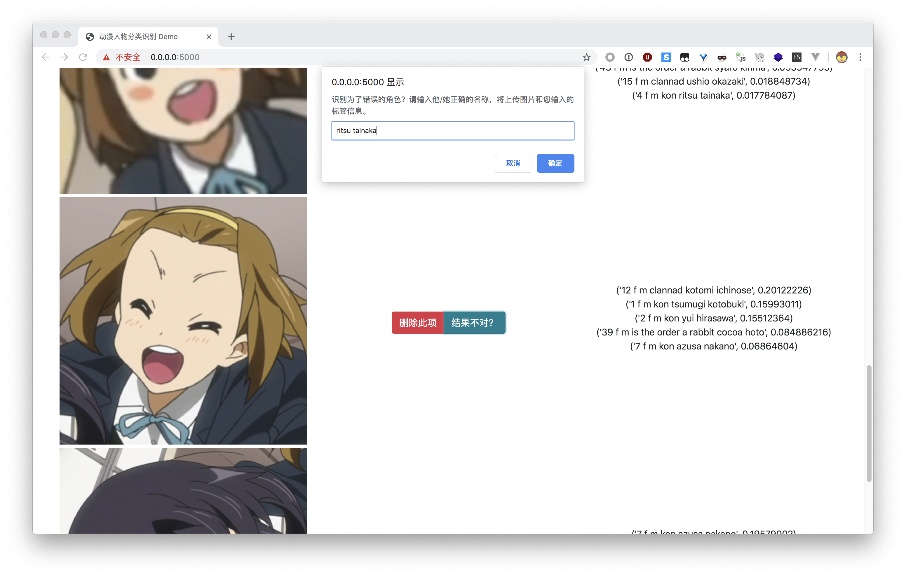

*反馈识别错误信息*

可以在 `user_report/` 目录看到用户的反馈。


提交的反馈结果图片存放在此目录中，文件名为用户反馈的正确标签。

当反馈数量足够多时，可以加入数据集，进行更进一步的训练。

## 实验总结

### 结果分析

张永停：

- 这次实验最初因为数据集过小但种类又多导致训练结果极差，随后对 7000 张图片进行训练得到了很好的结果。
- 但由于从训练集准确率和验证集准确率来看认为有点过拟合，我们进行了~~花样~~数据增广，并在数据增广上吃了不少亏。事实证明，数据增广要和具体分类相结合，不能随便扭曲以及更改像素。（具体分析见上文数据增广部分）
- 从数据增广的训练结果来看，我们认为是数据集大小导致的 7000 张图片的训练结果有一点过拟合。

陶柯宇：

- 数据收集的时候对于二次创作的插画等加入的比例很小，可能在这一点上数据集过于保守了，导致相比于动画本身出现的人物的截图，对其他创作者绘制的人物插画的识别率感觉并不是很高。但这又是一个两难的困境：加入太多的话，由于画风差异很大，噪音很高，训练的效果不会很好；加入太少的话，对这些图片的识别率也就不会很高。这是要仔细考虑的一件事情。
- 之前也参考过一些类似的项目，比如说 [transfer-learning-anime](https://github.com/freedomofkeima/transfer-learning-anime)。不过他分了 100 个分类，每类 60 张，[最后最好的结果](https://github.com/freedomofkeima/MoeFlow/blob/master/100_class_traning_note.md)是训练准确率 94.0%，而测试准确率 70.1%，我强烈怀疑这位仁兄因为数据量太小过拟合了……
- 啊，不过网页（自认为）还是挺漂亮的。

### 心得体会

张永停：

- 本次实验学到了不少 python 的用法，如正则表达式，参数，哈希函数等。此次实验也被 python 的缩进搞得焦头烂额，下次我一定记得 space, tab 不混用。(~~这是一个被 space 和 tab 搞哭了的人~~)
- 数据集真的很重要很重要!
- 数据增广要和具体情形结合。TAT
- 稍微学到了一点 tensorflow，以及发现 tensorflow 的 tutorial 真详细。学到了一个图像库的用法 imgaug。
- 体会就是，读代码写代码调参数=很痛苦，跑代码=充满希望，看结果=期待落空+怀疑人生。哈哈开玩笑，整体过程非常开心，觉得学到了不少东西。(我认为本门课是我这学期学到东西最多的课程)
- 本次实验的一个遗留问题是我还是没安装好 Tensorflow gpu 版本~~等考完期末我再折腾一下~~

陶柯宇：

- 这个坑是我开始挖的，当初我也没有想到自己竟然会花整整一个星期的时间收集数据，打标签。~~你看看，这是人干的事情吗~~
  - 打标签或许可以给神经网络之类的来初步筛选？这样的话预计可以省一些事，但对于这一点我还没有特别明确的思路。可能一个优化过的流程是：先初步挑每个分类几十张来跑，之后的图片先经过这样一个深度网络分类，然后再去看结果有没有问题。
  - 可以注意到，上面两个面部识别的算法（`lbpcascade_animeface.xml` 和 `animeface-2009`）都比较「古老」。我相信这个问题是可以用更加现代的方法去解决的，只是看起来没什么人去做而已。
- 在加用户反馈的功能的时候，差点写出来一个安全漏洞：用户输入的标签会直接作为文件名拼接起来然后保存，如果用户的输入是 `../../../xxx` 这样的话，那就可以在任意位置存文件了。解决方法是用 `secure_filename()` 处理。
  - 自己好歹也是打 CTF 的，竟然犯了这样一个错误，太惭愧了……
- 至于深度学习，我感觉自己依旧是一条咸鱼……未来的话，要搞 deep learning，感觉理论和实践都是相当重要的。之前看 Google 的深度学习入门，看了几章之后就开始有点晕了，这一点还是要克服一下。
- 当然最后，还是非常感谢本组的其他同学 ~~，竟然选了我这个坑题目来作为大作业~~。

付佳伟：

- 

李晨宇：

- 
