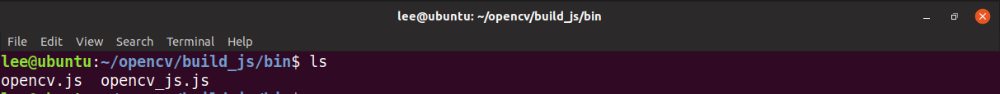
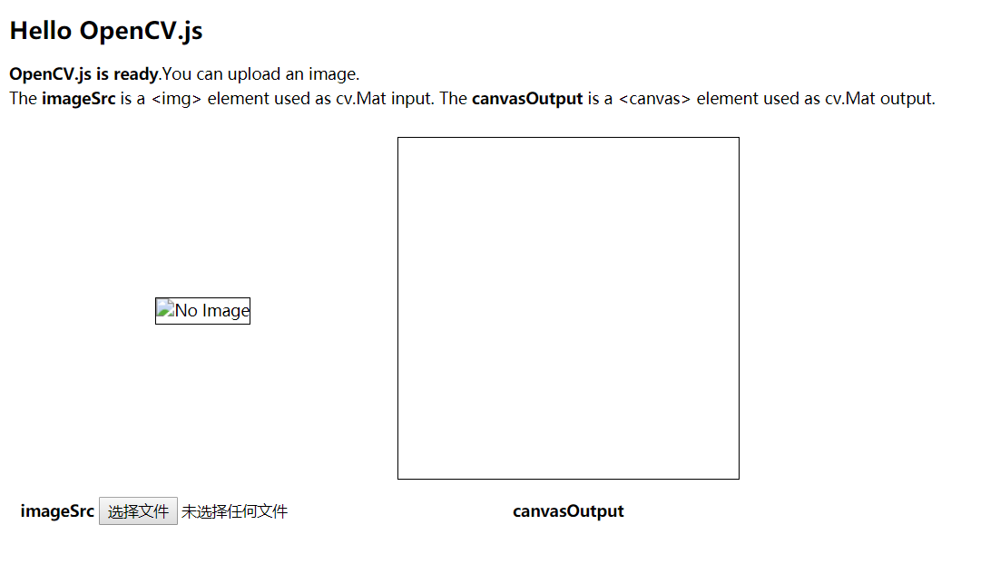

# 网站框架介绍
为了更好地让用户体验到我们的服务，以及更好地节约服务器资源，我们用了比较新颖的前端技术，将opencv的代码植入到了用户浏览器的前端。(~~为了更好地压榨用户的计算资源，节约服务器资源~~)
本网站采用了前端和后端分离处理的方式。前后端各司其职，经最大可能性的提升用户的体验。
## 前端

 - opencv.js
 - html
 - js
 
 ### opencv.js
 
 #### opencv.js 简介
 opencv.js 是基于 javascript 的 opencv。对于基于其他语言的 opencv 来说 opencv.js 是最为轻量级的 opencv ,有了它的存在我们可以实现在浏览器里进行图像运算的操作，将需要处理的图像进行预处理。这样不仅减少了服务器的运算压力，还极大的提升了用户体验，让用户实时的感受操作应用的快捷。

#### opencv.js 编译
其中为了得到原生的 opencv.js 的过程比较复杂,我们需要自己编译opencv.js 文件。

 1. 安装Emscripten

我们需要注意的是, Emscripten 的安装过程稍微比较慢，但是非常简单，我们跟着官方手册一步一步去做即可成功安装 Emscripten 。它对于我们是否能成功编译 opencv.js 至关重要。

 2. 获取 OpenCV 源码

opencv 的源码可以直接在 github 上获取。

    git clone https://github.com/opencv/opencv.git
    <opencv_src_dir>/platforms/js/build_js.py <build_dir>

需要注意的是我们需要 Python 和 cmake 。


3. 测试获得的 opencv.js 

我们将获得的 opencv.js 复制出来, 然后使用官方所给的最简单的例子来检测我们是否成功编译opencv.js 。
```
<!DOCTYPE html>
<html>
<head>
<meta charset="utf-8">
<title>Hello OpenCV.js</title>
</head>
<body>
<h2>Hello OpenCV.js</h2>
<p id="status">OpenCV.js is loading...</p>
<div>
  <div class="inputoutput">
    
    <div class="caption">imageSrc <input type="file" id="fileInput" name="file" /></div>
  </div>
  <div class="inputoutput">
    <canvas id="canvasOutput" ></canvas>
    <div class="caption">canvasOutput</div>
  </div>
</div>
<script type="text/javascript">
let imgElement = document.getElementById('imageSrc');
let inputElement = document.getElementById('fileInput');
inputElement.addEventListener('change', (e) => {
  imgElement.src = URL.createObjectURL(e.target.files[0]);
}, false);
imgElement.onload = function() {
  let mat = cv.imread(imgElement);
  cv.imshow('canvasOutput', mat);
  mat.delete();
};
function onOpenCvReady() {
  document.getElementById('status').innerHTML = 'OpenCV.js is ready.';
}
</script>
<script async src="opencv.js" onload="onOpenCvReady();" type="text/javascript"></script>
</body>
</html>
```
修改对应的参数, 然后让浏览器本地跑起来, 欣喜的是我们一次便成功的运行了代码。

    
#### 这里是fjw需要补充的技术细节介绍前端js的具体实现等等等
padding

## 后端

 - flask
 - tensorflow

### flask
我们采用 flask 框架。flask 很轻巧方便而且极其灵活, 并且 flask 为 Python 的库, 我们可以十分方便的将它与 tesorflow 进行交互。
那么我们拿 flask 进行了哪些工作呢？它主要负责用户与神经网络的交互，我们通过网页的形式极大的优化了用户体验，让用户只需要轻点鼠标即可完成相应功能的调用。
flask主要文件为:

 - app.py
 - classification.py
 - static文件夹
 - templates 文件夹


####  app.py
这个文件为整个flask web app 的核心文件，主要用于处理用户输入的图像数据和返回处理数据，并且作为相应前端文件的分发者。
#### classification.py
此文件作为神经网络的API接口, 我们通过此文件实现后端和神经网络的交互。
#### static 文件夹
里面的主要内容为所需要的前端文件,例如最为重要的 opencv.js。
#### templates 文件夹主要为网站的模板
flask 通过引擎动态的渲染网页。

还有一些具体的技术实现细节, 比如图片的分割与传送等我们用的成熟而又稳定的 base64 , 并且我们的接口是非常标准的网络API形式，如果你对此服务感兴趣可以直接通过调取我们的API实现你的功能。
总之，我们的设计理念是轻巧简约却不简单。


## Demo
这里应该是最终效果的展示图片
