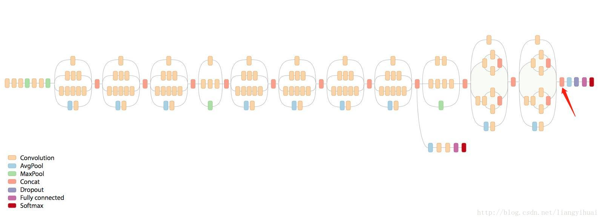
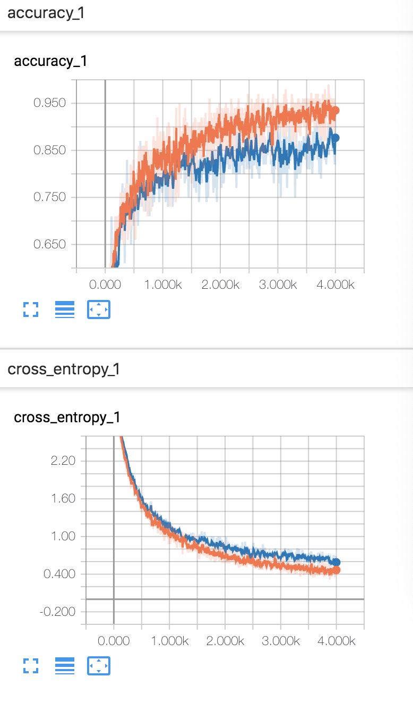
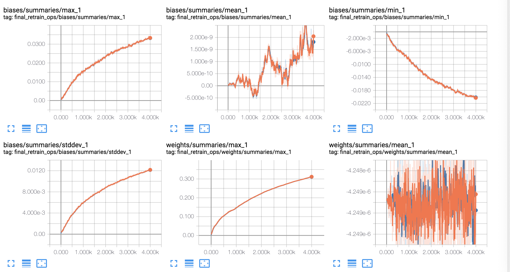
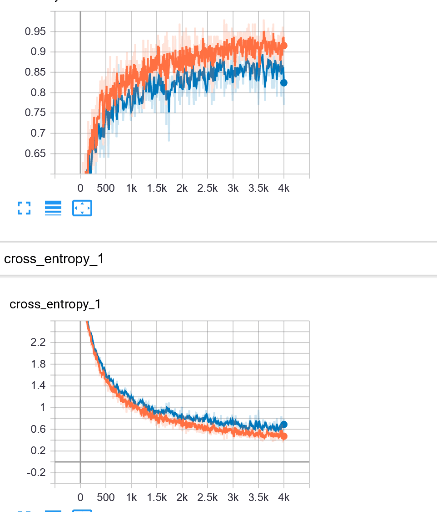
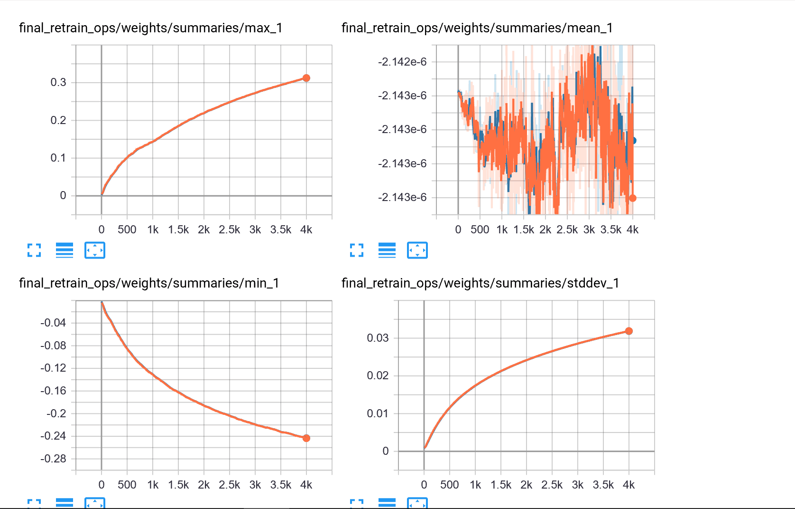
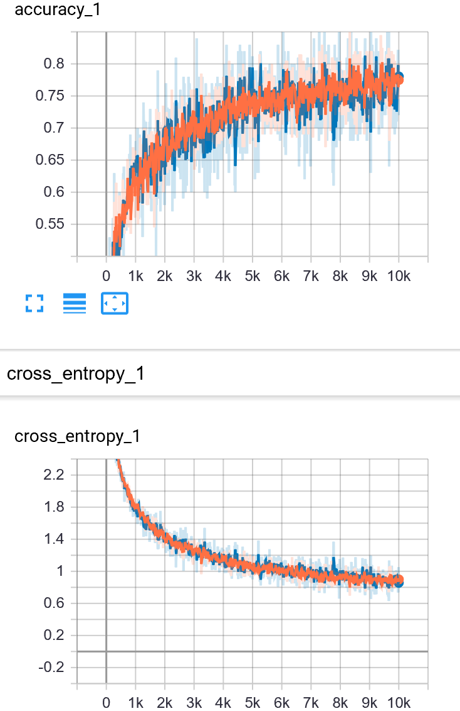
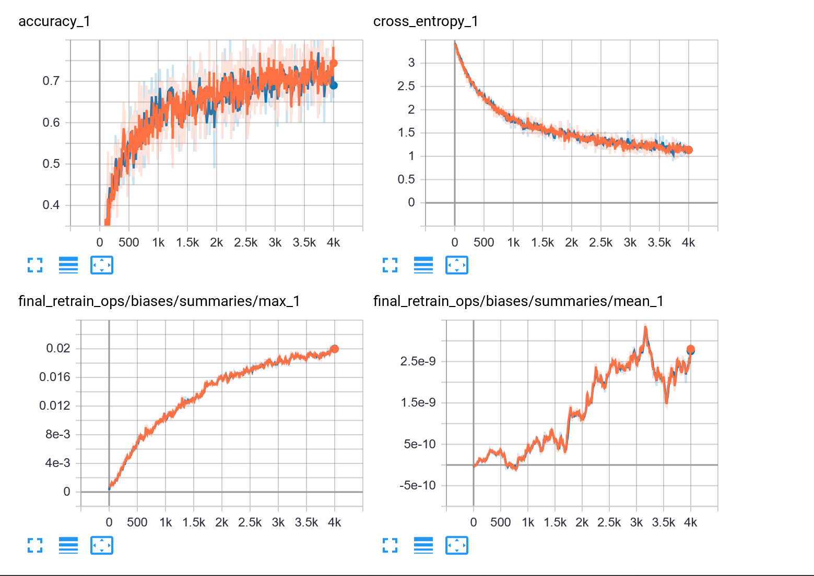

## Lab2_DL 算法部分报告

2019.5.29 by 张永停 PB17111585

### 算法原理

------

<!--算法是什么？基本原理？优势与不足？-->

#### 训练模型

- 算法以及具体实现

  - 由于此次实验~~是在数理方程考试后才开始做~~数据集个人团体收集较小，因此考虑迁移学习。
  - 本次实验采用Inception-v3模型，通过Inception-v3提取特征向量（瓶颈层），然后添加一层全连接层。通过训练确定全连接层的参数。
  - 

  ​	*Inception-v3模型，红色箭头前面部分是卷积层，后面是全连接层*

  - Inception-v3最后一个卷积层激活函数的输出值个数为2048，我们图片共有31个分类。全连接层的输入就是Inception-v3最后一个卷积层激活函数的输出值（2048维向量）。
  - 定义交叉熵作为损失函数，使用反向传播训练。训练时仅训练全连接层的参数。
  - 为了加快训练速度，我们将图片 的特征值缓存到硬盘中，这样在图片第二次被抽中训练时，可以直接从硬盘中读取特征值作为全连接层的输入数据。
  - 但如果使用该模块下的数据增广，则不会缓存特征值
  - 训练集，测试集，验证集默认比例8：1：1
  - 通过TensorBorad可视化

- 基本原理

  - Inception-v3由谷歌提出，主要用于ImageNet的大规模视觉识别任务。本次实验目的是对动漫人物进行分类，与Inception-v3任务相似。因此可以借用该模型当作特征提取器，只训练最后的全连接层。

- 优势与不足

  - Inception-v3反复使用了Inception Block，涉及大量的卷积和池化。其错误率只有3.5%。使用该模型当特征提取器准确率较高，且迁移学习不需要太大的数据集即可得到较准确的结果。
  - 直接使用Inception-v3来提取特征可能会导致训练效果有点差，不过总体来说这是我们在手头数据集不够大的情况下最好的选择。

#### 数据增广

- 最初数据集大小7000多，直接进行训练。

- <figure class="half">
      
      
  </figure>

  *没有数据增广之前的结果，训练集达到了95%的准确率，但验证集只达到了87%的准确率，我们猜测可能有点过拟合，因此考虑数据增广*

- 后来采用retrain.py中的数据增广操作（剪切，放缩，翻转，改变透明度），这样便不能提前缓存图片的特征向量，因为在每次抽中图片时对图片所做操作可能不一样，于是导致了速度极慢，~~我跑了一天+一晚上才跑出结果~~。但虽然跑了这么久，结果却并不是很理想，最终训练结果甚至没有没有数据增广时效果好TAT。

- <figure class="half">
      
      
  </figure>

  *使用简单剪切翻转数据增广的结果*

- 后来经过~~沉重的反思~~，我们发现是因为上述数据增广其实对动漫人物识别作用并不是很大。于是乎，便开始认真上网查找数据增广的方法，最终，我决定使用imgaug库来做数据增广(~~此处吐血三升，要是早点查就好了~~)。

- 由于许多动漫人物的重要区别点是头发和眼睛的颜色，因此我在进行数据增广时并没有选择改变像素的操作。本次数据增广主要有:镜像翻转，剪切，放缩，旋转，仿射变换(矩形变为平行四边形)，全白或全黑填充，高斯模糊，均值模糊，中值模糊，锐化处理，浮雕效果，改变对比度，移动像素，扭曲图像局部区域。这些操作会随机的被应用到图片上。考虑到数据集的大小，我选择将一张图片增广64张。

- <figure class="half">
      
      
  </figure>

  *数据增广的效果*

- *数据增广后的图片共7106\*65张*

- 但最后这样数据增广后的效果很差，虽然没有明显的过拟合现象了，但在训练10000步后依然准确率只有80%多，我们认为可能是这样数据增广其实并不太适合动漫人物，因为动漫人物的脸形非常重要，所以扭曲可能就造成不好的结果。

-  <figure class="half">
      
      
  </figure>

  *左边：训练10000步的结果 右边：训练4000步的结果*

- *数据增广的效果很差，~~但终于不过拟合了~~,我们此时认为之前训练略过拟合可能是数据集不够大*

#### 输入图像分类

- 此部分就没什么技术含量(雾)。

- 将输入图片传入训练好的模型(**此处附训练好的模型的地址**)，根据模型的输出值(31维向量)来判断该图片是哪一个动漫人物，并输出概率前五。

-  

  *对一张测试图片进行判断*

### 实验细节

------

<!--调整参数？修改loss函数?修改训练过程？以及一些其它有用或者没用的修改？最终训练的epoch,指标-->

- 使用交叉熵作为loss函数，我们没有修改loss函数，因为这是我们所知道的对图片分类最好的函数。
- 在数据增广的时候我们将step从4000增加到了10000，虽然最后结果还是不理想。之前训练时并没有增加step，因为从tensorboard的可视化结果来看，交叉熵和准确率都已经近乎不变了([图见这里](#2))。
- 本次实验在最初将图片传给Inception-v3得到的计算结果缓存到电脑，这样在之后训练过程中不需要重复计算。
- 本次实验采用随机梯度下降法。
- 我们将数据集扩大，将种类减少，使得训练结果更好(详见数据处理Taoky部分)；后期将数据增广，但并没有得到很好的效果(详见[这里](#3))。
- 最终我们采用7000张图片训练出来的结果，具体训练指标见[这里](#1)。

### 实验总结

------

<!--实验结果的分析，心得与体会-->

##### 结果分析

- 这次实验最初因为数据集过小但种类又多导致训练结果极差，随后对7000张图片进行训练得到了很好的结果。
- 但由于从训练集准确率和验证集准确率来看认为有点过拟合，我们进行了~~花样~~数据增广，并在数据增广上吃了不少亏。事实证明，数据增广要和具体分类相结合，不能随便扭曲以及更改像素。(具体分析见上文数据增广部分)
- 从数据增广的训练结果来看，我们认为是数据集大小导致的7000张图片的训练结果有一点过拟合。

##### 心得与体会

- 本次实验学到了不少python的用法，如正则表达式，参数，哈希函数等。此次实验也被python的缩进搞得焦头烂额，下次我一定记得space,tab不混用。(~~这是一个被space和tab搞哭了的人~~)
- 数据集真的很重要很重要!
- 数据增广要和具体情形结合。TAT
- 稍微学到了一点tensorflow，以及发现tensorflow的tutorial真详细。学到了一个图像库的用法imgaug。
- 体会就是，读代码写代码调参数=很痛苦，跑代码=充满希望，看结果=期待落空+怀疑人生。哈哈开玩笑，整体过程非常开心，觉得学到了不少东西。(我认为本门课是我这学期学到东西最多的课程)
- 本次实验的一个遗留问题是我还是没安装好Tensorflow gpu版本~~等考完期末我再折腾一下~~

### 参考资料

------

[Tensoflow官方教程:迁移训练](https://www.tensorflow.org/hub/tutorials/image_retraining)

[imgaug官方文档](https://imgaug.readthedocs.io/en/latest/)

以及CSDN上各个博主
